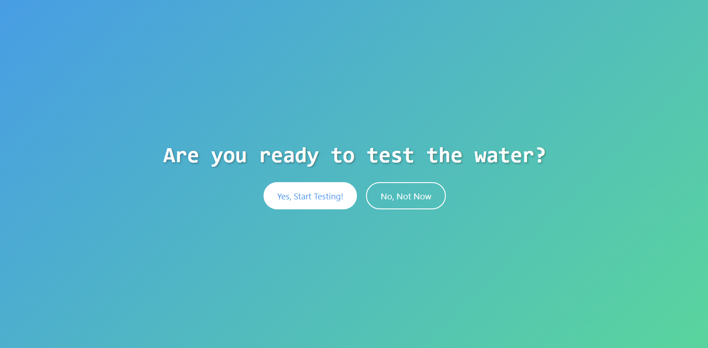
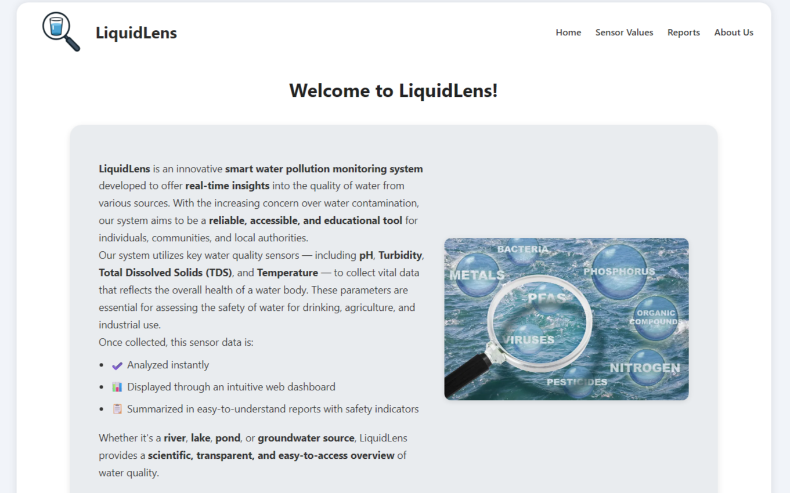

# 💧 LiquidLens – Smart Water Pollution Monitoring System

**LiquidLens** is an IoT-based water quality monitoring dashboard that provides real-time data on critical water parameters like pH, TDS, turbidity, and temperature. Built using ESP32 and Blynk Cloud, this system is designed to help monitor water pollution levels for domestic, industrial, or environmental use cases.

---

## 🚀 Features

- Real-time sensor data visualization  
- Dynamic dashboard updates every 5 seconds  
- Responsive, modern web interface  
- Reports table with status and remarks for each parameter  
- Local storage of sample collection details  
- Integration with Blynk Cloud API  
- Built using **HTML**, **CSS**, and **JavaScript (Vanilla JS)**

---

## 📊 Monitored Parameters

| Parameter   | Sensor Used         | Ideal Range     |
|------------|---------------------|-----------------|
| pH         | E-201-C pH Sensor   | 6.5 – 8.5       |
| TDS        | TDS Sensor          | 0 – 500 ppm     |
| Turbidity  | Turbidity Sensor    | 0 – 5 NTU       |
| Temperature| DS18B20 Waterproof  | 0°C – 32°C      |

> _More sensors like Dissolved Oxygen, Chlorine, E. coli, and Heavy Metals may be added in the future._

---

## 🖥️ Live Dashboard Overview

After clicking **"Yes"** to start the test, the dashboard fetches real-time sensor values from Blynk Cloud every 5 seconds and displays them in:

- **Main visual cards** for each parameter  
- A **structured report table** with:
  - Status check (Good/Poor)  
  - Remarks

---

## 📸 Screenshots

  
  


---

## 🧠 Tech Stack

- **Frontend:** HTML, CSS, JavaScript  
- **IoT Platform:** Blynk Cloud  
- **Microcontroller:** ESP32-WROOM-32  
- **IDE Used:** Arduino IDE

---

## 📁 Project Structure

<pre>/
├── images/         # Contains screenshots or assets used in the project            
├── index.html      # Main HTML file for the web dashboard 
├── script.js       # JavaScript for Blynk API data handling and logic 
├── style.css       # CSS for responsive and styled UI 
└── README.md       # Project documentation and usage instructions </pre>

---

## 🛠️ Setup Instructions

1. **Clone this repository:**

    ```bash
    git clone https://github.com/yourusername/liquidlens.git
    cd liquidlens
    ```

2. **Open** `index.html` in your browser to view the dashboard.

3. **Ensure your ESP32 board is:**
    - Connected to sensors properly  
    - Sending data to Blynk Cloud using your unique auth token

4. **In** `script.js`, replace the token value with your Blynk Auth Token:

    ```javascript
    const BLYNK_AUTH = "YOUR_BLYNK_TOKEN";
    ```

---

## 📌 Future Improvements

- Add real dissolved oxygen and chlorine sensors  
- Export reports as PDF or CSV  
- Integrate map-based location tracking  
- Add historical data visualization (charts)